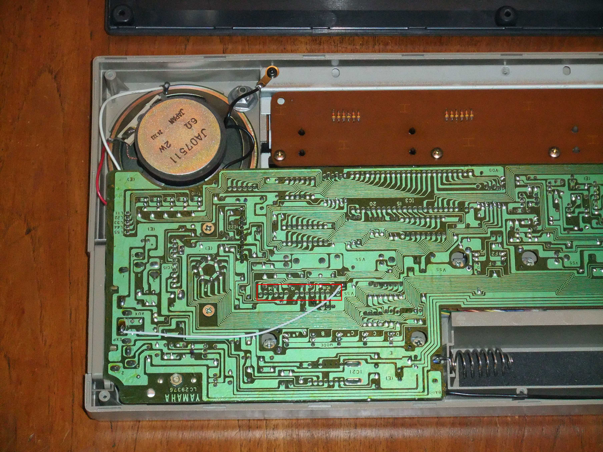

# Playcards &mdash; Yamaha Playcard Format Docs and Tools

## Introduction

In 1982, Yamaha released the PC-100 music keyboard. This keyboard has ten instruments, ten rhythms, and an automatic accompaniment feature. The most interesting feature of this keyboard, though, is the *Playcard System*. This system allows you to use Yamaha Playcards to play and learn music.

A Playcard is a large (a bit smaller than A4-sized) card with information about a song on one side, and sheet music on the other. On one edge there is a strip of magnetic tape. Data is stored on this magnetic strip in much the same way as on the magnetic strip of older credit cards. Each Playcard contains the melody, obbligato (countermelody or harmony), instrument and rhythm selections, tempo, chord changes, drum fills, etc. for one song.

When you put a Playcard into the slot on the keyboard and swipe it from right to left, the tape head inside the keyboard reads the data off the magnetic strip and, if it was a good read, an LED above the highest melody note lights up to let you know the card was loaded and is ready for playback. From there you can simply listen to the full musical arrangement, listen to everything except the melody so you can play or sing along, or use the *Free Tempo* mode. In *Free Tempo* mode, the keyboard stops the music each time you need to play a note, then waits for you to play the correct note. The tempo adjusts based on how long it takes you to find each note. This means it will slow down so a beginner can have more time to find the next note. Any of these modes can be combined with the *Phrase Repeat* function so you can practice one or more parts of the song repeatedly.

As the music plays, LEDs above the keys light up to show you which notes to play next. You can turn off the LED guidance if you want to play the song from memory or by reading the music.

Several Playcard-compatible keyboards were made, including the Yamaha PC-100, PC-1000, PCS-30, PCS-500, and a few others. The format probably lasted roughly from 1982 through 1985. It was never licensed to any other manufacturers. Each keyboard came with a set of six or twelve Playcards and a head cleaning card with a strip of fabric in place of the magnetic strip. Additional Playcards were sold in sets of six, and at least forty such sets are known to exist.

## Why this repository?

As good as Playcards are, they are fragile and easily damaged. Each Playcard contains a CRC near the end of the data on the magnetic strip. While this can be a good thing, as it allows a keyboard to reject a bad swipe rather than accepting it and trying to play garbage data, it also means that Playcards are an *all or nothing* format. If part of the magnetic strip is damaged, erased, or worn out, the entire Playcard becomes unusable. Furthermore, since this is a proprietary media format, there's no easy way to get at the data on the card for archival or backup purposes. Yamaha did not provide any way for owners of Playcards to make backup copies of the cards they owned, and even now the best way of archiving Playcard data requires making a small modification to the Yamaha PC-100. These Playcards haven't been made for decades, so the only source for them is likely to be eBay and similar places, and more often than not they are bundled with a keyboard which you may or may not need.

## What's in this repository?

A complete description of the Yamaha Playcard data format, and a set of tools that read it, write it, play it and take it apart.

The strip holds only about 300 bytes: the melody, the obbligato, the chord changes and the settings. Everything else &mdash; the accompaniment patterns and the drum patterns &mdash; lives in the instrument, and the card only says which of them to use.

The format was undocumented. It is documented now, in [playcard-format.md](playcard-format.md), and everything in this repository was built from that or went into it. **It was worked out from the ROM of the Yamaha UPA-01 Playcard System cartridge for MSX computers and the cards themselves, not from Yamaha's patents** &mdash; those were read at the end, and only to see whether they agreed. Two of them describe mechanisms that had already been found the hard way, which is confirmation rather than a source; the format document lists all nine and says what each one settles.

Direct link to an HTML version of the format description: <https://jaybird110127.github.io/playcards/playcard-format.html>

## AI coding disclosure

The programs and much of the documentation in this repository were written by Claude Code. I provided the Yamaha UPA-01 ROM, the Playcard binary images, and lots of information about beginnings, endings, and various parts of songs so Claude could correlate its findings with what I knew. I've also tested these tools by ear, and they work. I'm intimately familiar with many of these Playcards, and know how they should sound.

## Where can I get Playcard data files?

This project was built and tested against a corpus of 267 Playcard binary images, which are audio recordings of valid card swipes into a modified Yamaha PC-100 which have been converted into the binary data. As of this writing, the only known source of these binary images is a bit awkward. Visit [this page](https://www.dtech.lv/techarticles_playcards.html) and download the convertor and more tool. You'll get a zip. Unzip it and you should find a batch file which you don't need, as well as playcardbintowav2p.exe, a Windows command line executable. As of this writing, this executable file has SHA1 61e6a960727a2b5ab80427dc5dbaecee2de6ab5c. Run this on a Windows machine, at the command line, with the *-gimmebins* option. It will save the 267 binary files which can be used with the tools in this repository. Note: If you host these files in a more conventional format or know of another place that does, please get in touch and I'll update this file.

This collection does not include every Playcard known to exist, and I know of a few cases where there were multiple versions (different arrangements) of the same Playcard. These binary images are not included in this repository because they are almost certainly the copyrighted property of Yamaha, and many of the songs are copyrighted themselves. All 267 card images decode with a correct CRC, and every one of them survives a trip out to MIDI and back with its melody and obbligato note for note.

## I have some Playcards not in the collection, how do I archive them?

You will probably need a Yamaha Playcard-compatible keyboard to capture the data off Playcards. These keyboards already have the slot positioned properly so a Playcard's magnetic strip is read properly by the tape head inside the keyboard. You'll need to modify the keyboard.

A crude way to capture Playcard data is to tap the signal coming off the tape head, then record swiping a Playcard through the keyboard on a digital audio recorder or into a computer. However, I've found that the signal from the head isn't very strong, and any imperfections in the magnetic strip will also be captured, even if the keyboard ultimately accepts the swipe. A much cleaner signal can be captured if you have a Yamaha PC-100. Similar modifications can probably be made to other keyboards, but none are known at the time of writing. The description of that modification below, and the photograph with it, came from a page on crumblenet.co.uk. That page has gone, and is not in the Internet Archive either. What looks like the same site is now at [Tim's Tinkering](http://www.timf-tinkering.co.uk/keyb/packdata/playcards.php), where the Playcard pages remain, though the modification write-up is not among them. **The words and the picture are the original author's, not mine**, and are quoted here because they would otherwise be lost:

> In the PC-100, Pin 1 of IC16 carries an amplified square-wave representation of the tape signal, and is ideal for recording on an audio recorder. Using this signal has the advantage that any distortion present in the off-tape signal is effectively removed, and the captured audio will be near perfect. This will make a much better copy, or a much "cleaner" signal to feed back into the keyboard for replay, free of any noise or distortion.

> Removal of the bottom panel of the PC-100 keyboard reveals the solder side of the main PCB &mdash; fortunately you don't need to go any deeper into the keyboard to find IC16 as this is labelled on the solder side of the board. Despite the diagram in the service manual showing IC16 as a DIL package, it is actually a single row of 16 pins. Looking at the solder side of the main PCB, pin 1 of this IC is located almost in the middle of the board width-ways, approximately 4.5 inches from the board edge at the speaker side of the keyboard. The picture below indicates the position of IC16 with a red box. Looking at the picture, pin 1 is at the right-hand end, i.e. the furthest pin from the loudspeaker.

> Pin 5 of this is ground, and pin 1 is the playcard data signal. I hijacked the "Expression Pedal" socket on the side of the keyboard by cutting the track to the centre pin and connecting a wire between this and Pin 1 of IC16, to form a "Playcard Data Output" socket. This modification is also shown in the picture below. Of course, if you do this, you have to be careful not to short out this connector, or you may irreparably damage the keyboard.



For anyone who cannot see the photograph: the keyboard is face-down with the bottom panel removed, so the whole solder side of the main board is visible and all of its silkscreen lettering reads mirrored. The loudspeaker is at the top left, and *YAMAHA LC29376* is printed along the bottom edge. The red box sits a little to the right of centre and just below the middle of the board, drawn around a single row of pads with *IC16* printed beside it; pin 1 is the right-hand end of that row, the end furthest from the loudspeaker. A pale wire runs from that end of the row down and to the left across the board to the expression pedal socket, which is the modification described above.

## How do I feed Playcard images into my real keyboard?

The `card_to_swipe.py` script in this repository will turn any Playcard binary image into a .wav file suitable for loading into a keyboard as though it were a real Playcard being swiped. The hard part is actually getting this audio into the keyboard.

If you've tapped directly off the signal from the tape head (but probably not if you've tapped off IC16 on a PC-100!) in order to archive Playcards, you can use this connection in reverse to feed audio into the keyboard as though it were coming off the tape head. Otherwise, the best way I've found is to obtain an electromagnetic pickup coil (one of those suction cup things designed for recording telephone conversations from the receiver of a corded telephone) and place it near the place in the Playcard slot where the tape head is. You plug the coil into a headphone output of a stereo amplifier, then feed Playcard audio to the keyboard. You're basically using the pickup coil in reverse, and it takes a strong and/or proper impedance signal for it to work. I've found that one stereo amplifier I own will work if I turn it up to near maximum volume, but others don't.

What is clearly needed is some type of device which can actually fit inside the Playcard slot so it can make direct contact with the tape head. An audio cassette adaptor for cars with tape players but no CD or line in capability would probably work wonders here, except that the part which actually makes contact with the tape head is too thick to fit into the Playcard slot. If anyone finds a better way to inject Playcard swipe audio into a keyboard, please get in touch.

## Getting started

The rest of this document outlines what is in this repository and how to use it.

Nothing needs installing: it is plain Python 3 with no third-party packages. The C tools want a compiler, and only if you want audio.

```bash
python playcard_decode.py mycard.bin        # what is on the card
python card_decompile.py mycard.bin -o mycard.mid
```

You supply the cards. See [what you need](#what-you-need) at the bottom.

## Reading a card

**`playcard_decode.py`** &mdash; the decoder, and the thing everything else is built on. Run it on a card image and it prints the header, the melody, the obbligato, the chord chart, the durations, and the repeat structure.

```bash
python playcard_decode.py card.bin
```

**`card_dates.py`** &mdash; every card carries a date in its last three bytes, which the instrument never reads. This prints them for the whole collection, with the weekday distribution that shows they are real working days.

**`card_limits.py`** &mdash; *will a real keyboard accept this card?* It runs the cartridge's own parser over the image and reports what the firmware would return. Useful when you have made a card yourself and want to know before you burn a swipe.

```bash
python card_limits.py mycard.bin
python card_limits.py side-a.bin side-b.bin      # a two-sided pair, in order
```

**`header_edit.py`** &mdash; shows the header in musical terms, and rewrites it, fixing the checksum for you.

```bash
python header_edit.py card.bin                                  # just look
python header_edit.py card.bin -o out.bin --tempo 120 --rhythm waltz
```

## Hearing a card

There are several ways, and they answer different questions.

### The one to use: emulate the machine, render the audio

Two small C programs in [`csrc/`](csrc/README.md). The first boots an emulated Yamaha CX5M with the real Play Card cartridge in it, reads your card the way the machine would, and records every write the firmware makes to the FM chip. The second turns that recording into a `.wav`.

```bash
cd csrc && make && cd ..
csrc/playcard mycard.bin -o card.fmlog
csrc/fmlog2wav card.fmlog card.wav --normalize
```

Run these from the top of the working tree, as above, so they find `Roms/` where everything else expects it. They will look one directory up as well, so working inside `csrc/` is fine too, and `--roms DIR` or `PLAYCARD_ROMS` overrides both.

It will also show you the cartridge's own front panel &mdash; the voices, rhythm and sustain it thinks the card asked for, read out of the emulated video memory:

```bash
csrc/playcard mycard.bin -o card.fmlog --screen panel.txt --screen-at 5
```

And it will set that panel for you &mdash; the five part volumes, the tempo and a transpose of the whole arrangement &mdash; exactly as a player would from the keyboard:

```bash
csrc/playcard mycard.bin -o card.fmlog --mix karaoke
csrc/playcard mycard.bin -o card.fmlog --volume melody=40,rhythm=24 --tempo +8 --transpose -2
```

Left to itself the cartridge plays the melody about 9 dB under the bass and drums, so by default `csrc/playcard` uses a mix of its own, `lead`, that brings the melody to the front, just over the obbligato. The instruments are not equally loud (the oboe is 8.6 dB louder than the piano at the same setting), so `lead` sets the levels from the instruments each card uses, from measurements of every one. `--mix karaoke` is the same with no melody at all, and `--mix cartridge` leaves the panel as the UPA-01 sets it. [csrc/README.md](csrc/README.md) has the details, including what each key on the real panel does.

It also repairs the cartridge's most irritating bug. Switch to the alternate accompaniment with a bar mark 7, stay on one chord, and the UPA-01's chord notes fall silent until the chord changes. The fault is a routine that sends the chord part "no chord" on every change of pattern and never sends the real chord again. `csrc/playcard` re-sends it, and `--keep-chord-dropout` leaves the bug alone. `--as-is` runs the machine untouched, with its own mix and its bugs, for anyone studying the firmware.

A 90-second card goes from image to audio in about two seconds. Neither program understands the Playcard format &mdash; Yamaha's own firmware does the decoding, so what comes out is what the machine does rather than what we think it does.

This needs three ROM images. See [Roms/README.md](Roms/README.md).

### The same machine, in Python

**`msx_player.py`** does exactly what `csrc/playcard` does, far more slowly &mdash; the C one runs at about 150x real time, this at 79% of it &mdash; and is the one to reach for when something is wrong, because it can stop the machine and tell you what is in a byte.

```bash
python msx_player.py card.bin --log out.fmlog
python msx_player.py --roms              # check the ROM images are where it expects
```

### As a MIDI file

**`midi_export.py`** writes what is literally on the card: melody, obbligato, and the chord chart, three tracks, no accompaniment.

**`pcs30_arrange.py`** writes a full five-part arrangement &mdash; melody, obbligato, bass, guitar and drums &mdash; by adding the accompaniment patterns from a PCS-30 keyboard, the way that instrument would play the card.

```bash
python pcs30_arrange.py card.bin -o card.mid
```

This one needs the pattern tables, which are Yamaha's music and are not in this repository. Run `pcs30_extract.py` once against a PCS-30 ROM you own and it will build them.

### Under openMSX &mdash; historical

`play_card.py` and `card_to_midi.py` drive a real openMSX installation. **They came first, and everything in this project up to mid-2026 was measured through them.** Nothing needs them now. `csrc/playcard` runs the same cartridge about 150 times faster, at the right tempo, with no emulator installed; `msx_player.py` does the same in pure Python when something needs stepping; and `csrc/playcard --screen` reads the cartridge's own settings panel, which was the last thing openMSX was still required for.

They are kept because they work and because several notes in `HANDOFF.md` are about their quirks. If you use them they want openMSX on your PATH, or `$OPENMSX_PATH`, or `--openmsx`.

### On real hardware

**`card_to_swipe.py`** turns a card image back into the audio a card reader would have heard. Play it into a coil held against the tape head and the keyboard reads it as a card.

```bash
python card_to_swipe.py card.bin -o card.wav
```

**`swipe_to_card.py`** goes the other way: give it a recording of a card being swiped and it recovers the image. It copes with tape speed that wanders and with a baseline that drifts, which real recordings do.

## Making and changing cards

**`card_decompile.py`** and **`midi_compile.py`** are a matched pair, and the point of them is the round trip: decompile a card to a four-channel MIDI file, edit it in whatever you like, compile it back.

```bash
python card_decompile.py card.bin -o card.mid
# edit card.mid
python midi_compile.py card.mid -o new.bin
```

Everything the card can carry survives that trip. `midi_compile.py` reports anything the format cannot express rather than quietly dropping it, and `--sides auto` will split a piece that is too long across a two-sided card.

The card's header &mdash; tempo, rhythm, the two voices, key, sustain, the accompaniment pattern &mdash; travels in a text event inside the `.mid`, so a decompile-edit-recompile cycle remembers it for you. If your editor will not write text events, every one of those fields has a command-line option instead:

```bash
python midi_compile.py song.mid -o song.bin --tempo 120 --rhythm swing \
    --melody-voice clarinet --obbligato-voice strings --sustain on
```

**`make_test_midi.py`** generates a MIDI that never was a card, for testing the compiler on material it has not seen.

**`make_random_card.py`** generates structurally valid cards with nonsense music, for putting a keyboard through its paces. Every header field over its whole legal range.

**`forge_crc.py`** repairs the checksum of a deliberately corrupted card, so a keyboard will accept it and you can hear what it does with nonsense. Damaging a card on purpose is one of the better ways to find out what a field means.

**[`Sample Playcards/`](Sample%20Playcards/README.md)** holds cards written as MIDI and compiled, kept as worked examples &mdash; and its README is the guide to writing your own: the four channels, the control notes on channel 4, and everything MIDI can ask for that a Playcard cannot carry. Start there if you want to make a card.

**[`new-cards/`](new-cards/README.md)** holds cards written in 2026 from the spec &mdash; as far as anyone involved knows, the first new Playcards since the format went out of use. Each one isolates a single question no original card could answer, and the scripts that build them are beside them.

## Looking inside the firmware

**`z80dis.py`** disassembles a ROM; **`z80run.py`** executes one. The second exists because some questions about a firmware are answered far more cheaply by running a subroutine with a made-up machine state than by reading a disassembly and hoping you followed every jump.

```bash
python z80dis.py 5F8B 5FC2
python z80run_test.py            # 17 hand-computed results, before trusting it
```

`csrc/playcard` can also watch memory while a card plays, which is how you find out whether the firmware ever *looks* at a byte it writes:

```bash
csrc/playcard card.bin --watch 0xD349 --watch-out card.watch
```

**`sweep_block2.py`** is an example of that turned on the whole collection, and **`same_root_entries.py`** is a corpus-wide look at one odd corner of the chord chart &mdash; entries that name a root the sound chip cannot play, which turn out to mean &ldquo;keep the chord you have and add this to it&rdquo;.

## The PCS-30

The PCS-30 is a different Playcard-capable keyboard, and the source of the accompaniment this project uses. How it makes its sound &mdash; its sound chip, voices, filters, drums and tempo, read from its ROM and measured from recordings of a real one &mdash; is in [pcs30-sound.md](pcs30-sound.md).

Run this once and the rest work without a ROM:

```bash
python pcs30_extract.py
```

**`pcs30_synth.py`** plays a card the way a PCS-30 would sound, as a `.wav`. It is a work in progress: close, but its balance is still being tuned against recordings of a real keyboard.

```bash
python pcs30_synth.py mycard.bin -o mycard.wav
```

**`pcs30_rhythm.py`** prints the accompaniment patterns over any chord you name; **`pcs30_drums.py`** prints the drum patterns and the six fills; **`pcs30_demo.py`** pulls out the three demo tunes stored in the keyboard's ROM.

```bash
python pcs30_rhythm.py --chord G7 --rhythm march
python pcs30_drums.py --rhythm waltz
```

## The libraries

Not command-line tools, but the parts everything else is assembled from: `playcard_encode.py` builds a card from scratch, `playcard_resolve.py` reproduces the firmware's repeat resolution exactly, `playcard_expand.py` and `playcard_compress.py` handle repeat spans, `playcard_midi.py` holds the channel layout the round trip depends on, and `pcs30_tables.py` loads the PCS-30 pattern data for whatever wants it.

## What you need

**Card images** go in `Original Playcards/`, or set `PLAYCARD_CARDS`. They are not here: they are Yamaha's.

**ROM images** go in `Roms/`, or set `PLAYCARD_ROMS`. Also not here, for the same reason. **Most of these tools need no ROM at all** &mdash; [Roms/README.md](Roms/README.md) says which need which, and what a good dump of each looks like.

Anything that does need a ROM says which one, where it looked, and what to do about it, then stops. Nothing throws a traceback at you.

The same goes for handing a tool the wrong file. Point one at a MIDI when it wants a card &mdash; easily done, they sit in the same folder &mdash; and it tells you what you gave it and what it wanted:

```
w.mid is a MIDI file, and this tool wants a Playcard image. Check the filename,
or the tool.
```

## The documents

| file | what it is |
|---|---|
| [playcard-format.md](playcard-format.md) | The format itself, in full. Start here |
| [HANDOFF.md](HANDOFF.md) | The state of the work: what is settled, what is still open, and which past conclusions turned out to be wrong |
| [midi-roundtrip-design.md](midi-roundtrip-design.md) | How the decompile/compile cycle is designed and why |
| [pcs30-sound.md](pcs30-sound.md) | How the PCS-30 keyboard makes its sound: chip, voices, filters, drums, tempo |
| [csrc/README.md](csrc/README.md) | The C emulator and renderer |
| [Sample Playcards/README.md](Sample%20Playcards/README.md) | How to write a MIDI file the compiler will take, and what the format cannot carry |
| [new-cards/README.md](new-cards/README.md) | The cards written for this project, and what each one asks |
| [Roms/README.md](Roms/README.md) | Which ROM goes with which tool |

## What is deliberately not here

Yamaha's material: the card images, the ROM images, and the instrument's accompaniment and drum patterns. Those are the music. The code, the addresses and the description of the format are a description of how a machine behaves, and those are here.

## Resources

[Tim's Tinkering](http://www.timf-tinkering.co.uk/keyb/packdata/playcards.php) has a good deal about the Playcards themselves: which sets were released, cover scans, and a couple of recordings of cards being played. It appears to be the present home of the site that once carried the PC-100 modification quoted above.

[This page](http://weltenschule.de/TableHooters/Yamaha_PC-100.html) has more about the Yamaha PC-100 itself, including pinouts of various chips.

## Getting in touch

If you have any more Playcards, or a better source for the 267 binary images, or know of a better way to archive more Playcards or feed Playcard audio back into a keyboard, or just want to get in touch, feel free to reach out. You can find me on [Mastodon](https://dragonscave.space/@jaybird110127) or you can Email me. Sorry my Email address is scrambled, I'm just trying to keep the spammers out. Email me at: jay bird at blue grass pals dot com

## Licence

- The work in this repository is licensed under the BSD 3-Clause License, except for the quoted text above concerning modifying a Yamaha PC-100 and the accompanying image, which is *not my own work*. See [`LICENSE`](LICENSE) for the terms.

- Two components under `csrc/` are other people's work and carry their own notices:

    - The Z80 core by Nicolas Allemand, MIT License. See [`csrc/Z80_LICENSE`](csrc/Z80_LICENSE).
    - The YM2151 core from Aaron Giles' ymfm, BSD 3-Clause, under his copyright. See [`csrc/ymfm/YMFM_LICENSE`](csrc/ymfm/YMFM_LICENSE).

- Any Playcards you create with the tools in this repository are yours to do with as you please, assuming you own or otherwise have the rights to use the music in this manner or it is in the public domain.

- Original Yamaha Playcards, ROMS, and accompaniment and drum patterns are the copyrighted property of Yamaha, and many of the songs are copyrighted by their respective copyright holders. Nothing in this repository gives you any license to use them, and they are not included here.
